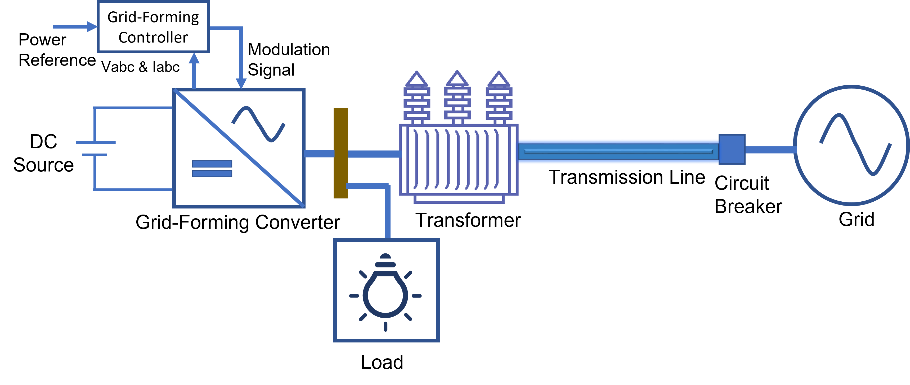

# Power Converter Circuit and Control Design with Simscape
Power converters are basic building block for various electrification applications 
such as motor drives, chargers, automobile, aerospace, distributed generation,
renewables, battery energy storage systems, and consumer appliances.
A modern power grid comprises multiple distributed generation (DG) units with power converter interfaces.
These DG units are connected at distribution and sub-transmission voltage level. With the rise of power electronics 
converter-based resources and the gradual reduction in numbers of synchronous machines, 
contemporary power systems face challenges with low inertia and limited short-circuit 
current capacity. These challenges cannot be solved with traditional grid-following converter 
control based on grid measurements and phase locked loops. 
A better alternative to the traditional grid-following converters are grid-forming (GFM)
converters.

## Description and Performance Evaluation
Grid-forming converters offer the inherent benefits of traditional 
synchronous machines, including inertia, damping, fault current, active power 
control, and reactive power control. In GFM converter system, the converter 
control strategies mimics the dynamic response of the traditional synchronous machine. 
This helps the power system to operate in a stable condition against various 
system disturbances. The GFM converters operate autonomously, respond 
to the grid transients without external commands and offer black start capability. 

This design solution presents a generic GFM converter design and its transient response analysis 
using Simscape&trade; Electrical. The design solution demonstrates grid-forming 
capability that you can use for integration of photovoltaic system, battery energy 
storage system, or wind power system. It provides an alternative inertia emulation technique, 
configurable control loops, different current limiting methods, and is suitable 
for a wide range of network strengths. This workflow offers a platform to design 
and test grid-forming control. You can also check conformance to grid codes.

This figure shows the GFM converter response for the wide change in grid frequency as 
mandated by GC0137 grid code standard. The grid frequency first increases from 50 to 52 Hz 
at the rate of 2 Hz/second. Then the grid frequency decreases from 52 Hz to 47 Hz at 
the rate of 1 Hz/second. GFM converter must be able to operate in these tough frequency situations. 

## Setup
* Clone the repository and add it to your MATLAB&reg; path.
* Open GridFormingConverterWithSimscape.prj to get started.
* To open the example, use the project shortcut buttons in the toolstrip.
* Requires MATLAB R2023a or later.

Copyright 2023 The MathWorks, Inc. 

